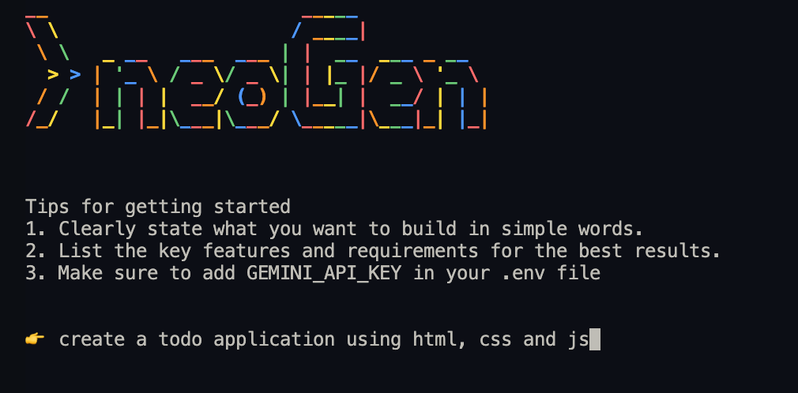
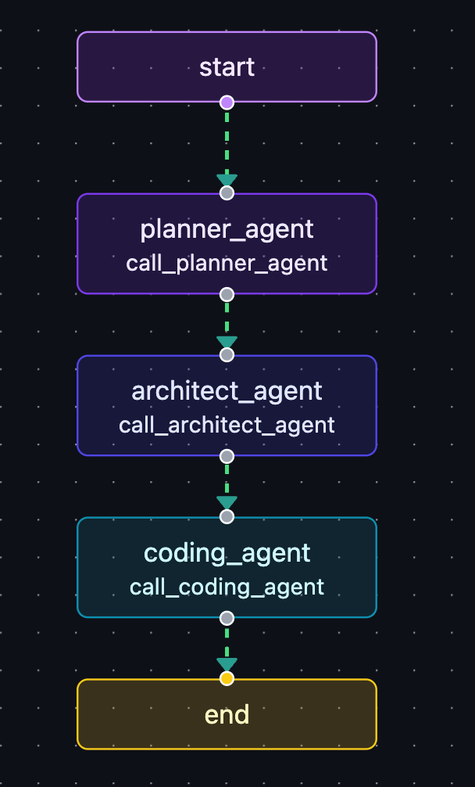

# neoGen


**neoGen** is a **CLI-based coding agent** built with **LangChain** and **LangGraph**.  
It is a powerful, autonomous system that **plans, architects, and codes entire applications**—all powered by the LLM of your choice (currently using the **free-tier Gemini-1.5-Flash**).  

---

## 🚀 Features  
- **End-to-End Development** → From idea to production-ready code.  
- **Planning & Architecture** → Automatically determines the project scope, tech stack, and file structure.  
- **Autonomous Coding** → Generates high-quality, structured code for every planned component.  
- **LLM-Powered** → Flexible integration with multiple LLMs (default: Gemini-1.5-Flash).  
- **Graph-Based Flow** → Modular and extendable workflow using **LangGraph** nodes.  

---

## 🧠 Workflow (LangGraph Nodes)  

neoGen’s intelligence is split across specialized nodes:  

1. **Planning Node** 📝  
   - Defines application **name, description, tech stack, features**.  
   - Generates a complete **file structure** needed for the project.  

2. **Architect Node** 🏗️  
   - For each file specified by the Planning Node, it creates the **architecture and coding guidelines**.  
   - Breaks down coding tasks into smaller, actionable steps.  

3. **Coding Agent** 💻  
   - Implements the **actual code** for each task based on the Architect Node’s plan.  
   - Ensures consistency, modularity, and coding best practices.  



---

## 🔧 Tech Stack  
- [LangChain](https://www.langchain.com/) – Orchestration  
- [LangGraph](https://www.langchain.com/langgraph) – Graph-based workflow  
- [Gemini-1.5-Flash](https://ai.google.dev/) – Default LLM (free-tier) 

---

## 📦 Installation  

Clone the repository and install dependencies:  

```bash
git clone https://github.com/yourusername/neogen.git
cd neogen
pip install -r requirements.txt
```

---

## 🤝 Contributions are welcome!

- Fork the repository
- Create a new branch (git checkout -b feature-name)
- Commit your changes (git commit -m 'Add feature')
- Push to the branch (git push origin feature-name)
- Open a Pull Request